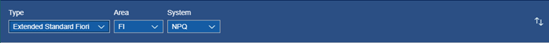
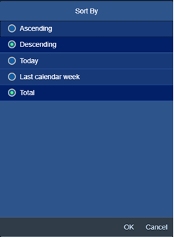

# Fiori Apps' Usage

The tool enables monitoring of SAP Fiori application usage in multiple systems in your SAP landscape.

Each time the user starts the application in SAP Fiori launchpad Fiori App's Usage plugin collects start records with time stamps. Based on the records, the tool provides number of reports:

1. Ranking o most frequently used applications
2. Ranking of users that have used the chosen application most often
3. Raw usage records as Excel file export 

*1. Ranking o most frequently used applications*

You can chose the system for which you would like to see the ranking, filter out the records from a specific functional area or specific application type.

You can also sort the list of applications based on start collected within a day, last week or in total.

You can also export all records to Excel file and prepare aby other report of you choice. 

