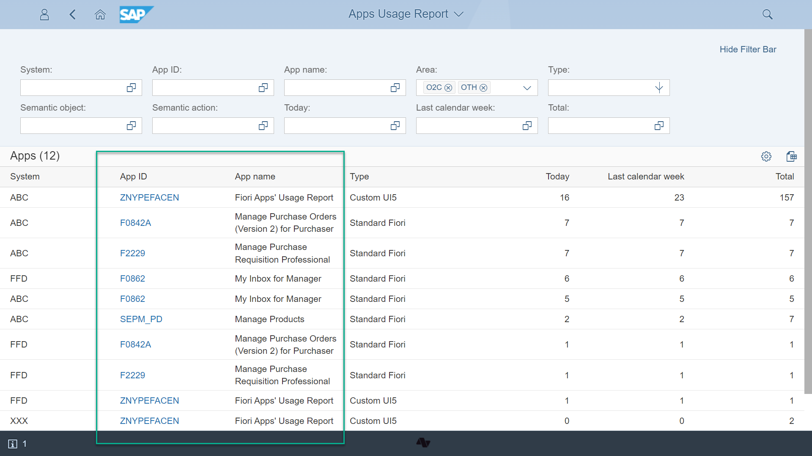

# Apps identification

Usage report identifies applications names by matching their semantic object and action with corresponding ["To-be" records](to-be-records.md). The "To-be" records come from Fiori Tacker Core.

If you want to have an App ID listed please maintain that App ID for your semantic object action pair in FT Applications app from [Fiori Tracker Core]( {{ prod.fa.R2020FPS01.compatibleCoreLink }} ).

For SAP standard apps for App ID use the "App ID" field from SAP Fiori Apps Reference Library. For example "F3140" (https://fioriappslibrary.hana.ondemand.com/sap/fix/externalViewer/#/detail/Apps('F3140')/S20OP). For custom apps, the BSP name. For example ZFTCA.  

