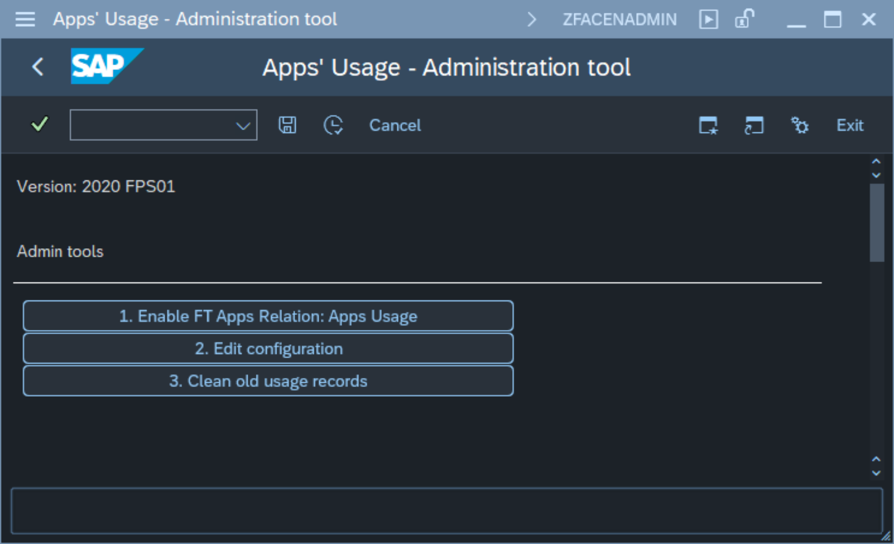
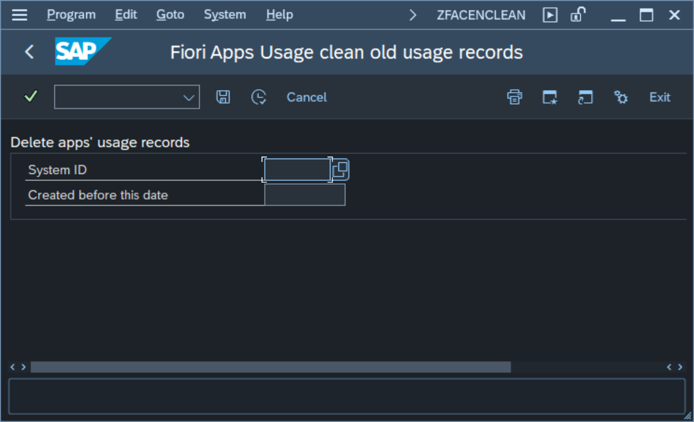

# Cleaning old usage records

The Fiori Apps' Usage Report comes with old usage records cleaning tool. The cleaning tool is available form Administration tool started with transaction **ZFACENADMIN**. To lunch the tool start the transaction and chose function *3. Clean old usage records*:

The cleaning tool has two input fields:

1. System ID - specifies the system for which you want to delete the records
2. Created before this date - It allows you to define the cut-off date. All records saved prior to this date will be deleted.

