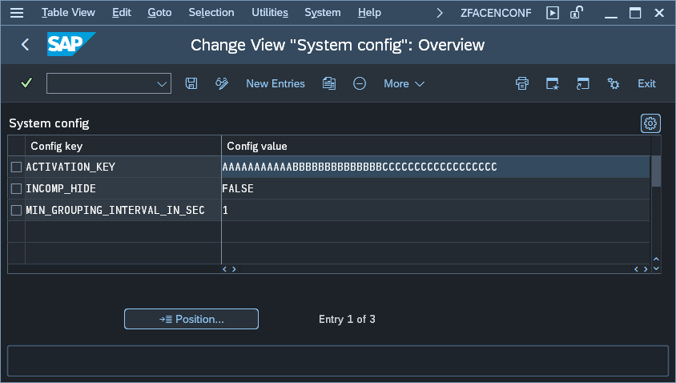

# Apps' Usage Report - Central part's configuration parameters

To change Central part configuration start the transaction **zfacenadmin** and press button labeled: **2. Edit configuration**. This will open a maintenance view for table ZNYPEFACEN_SC:

The table below descries all available parameters:

| Key                          | Value     | Description                                                                                                                                                                    |
|------------------------------|-----------|------------------------------------------------------------------------------|
| ACTIVATION_KEY               | *key*     | Value is provided by Nype team         |
| MIN_GROUPING_INTERVAL_IN_SEC | *seconds* | The value sets the minimum interval in seconds in which the grouping of records takes place. This setting is to avoid excessive calculation requests that could impact the system's performance. |
| INCOMP_HIDE                  | **TRUE** | When set to TRUE the version compatibility warning will not show |
