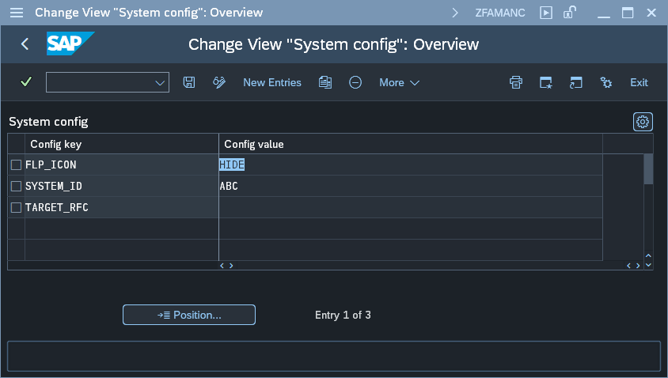

# Apps' Usage Report - Managed part's configuration parameters

To change Central part configuration start the transaction **zfamanadmin** and press button labeled: **2. Edit configuration**. This will open a maintenance view for table ZNYPEFACEN_SC:

The table below descries all available parameters:

| Key                          | Value     | Description                                                                                                                                                                    |
|------------------------------|-----------|------------------------------------------------------------------------------|
| FLP_ICON                     | **HIDE**      | When Value is set to HIDE the SAP Fiori launchpad icon for the plugin is not displayed         |
| SYSTEM_ID                    | **ID of a Central system**      | This setting enables overwriting the real system ID to one set by the parameter         |
| TARGET_RFC                   | **RFC name**      | RFC destination name of the Central system         |