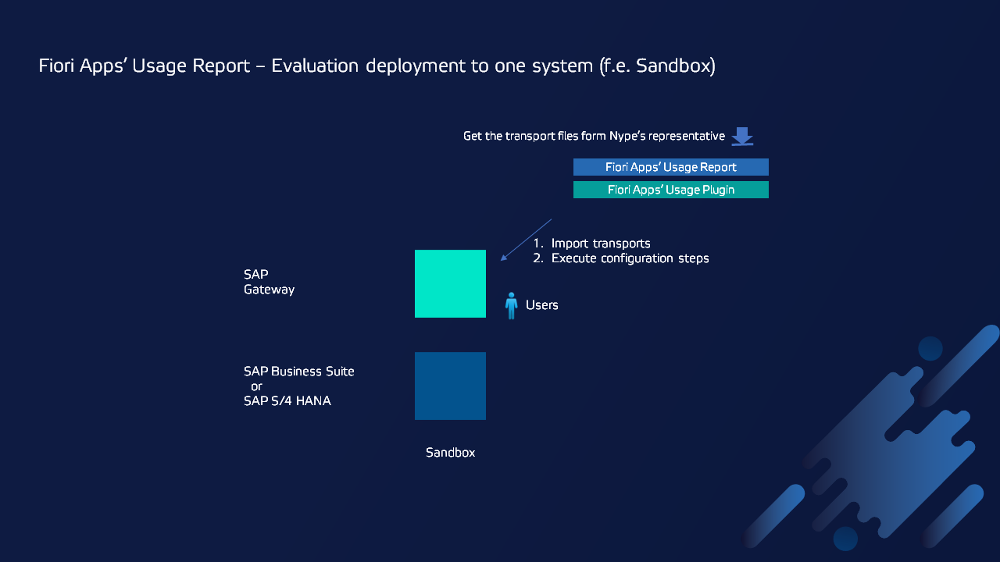

# Fiori Apps' Usage Report - Evaluation deployment

The simplest deployment option to evaluate Fiori Apps' Usage is the installation of all required products in one system (f.e. in Sandbox system).

The products that you need to install are:

1. Fiori Apps' Usage Report
2. Fiori Apps' Usage Plugin

## Other deployment options

1. [Fiori Apps' Usage Report on production](deployment/prod.md)
