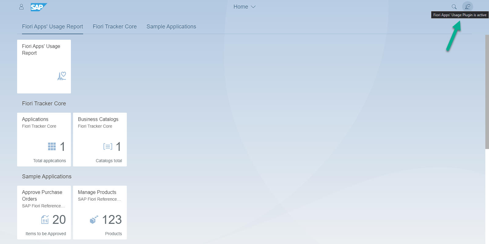

# Installation of Fiori Apps' Usage Plugin located on Managed system

Steps for Basis expert:

1. [Obtain and import the transport files for release `2020FPS01`](../inst/step-1.md)
2. [Activate Frontend ICF nodes](../inst/step-2.md) for node `zftappusageplug`
3. [Enable backend odata service](../inst/step-3.md) for service `ZNYPEFAMAN_SRV`
4. [Set the central system](set-cen.md) *see note*
5. [Assign pfcg roles](../inst/step-4.md) for role `ZNYPE_FAMAN`

!!! Note 
    You can skip this step 4 if your are installing Plugin on Central system

When the Plugin is active you will see the icon in top bar of your Fiori launchpad:

See also [optional steps](inst-man-optional.md).