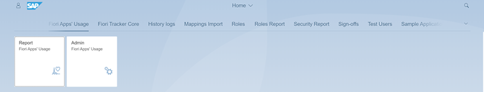
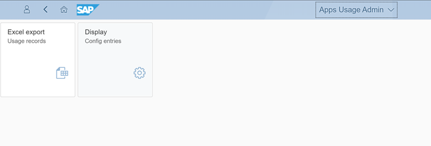

# Records export

Fiori Apps Usage Report offers raw usage records export in Excel format. Export function lets you prepare statistic reports and data visualizations with your favorite analytical tool.

The function is available from the Apps' Usage Admin app:

[Example export file](res/apps-usage-export.xlsx)

