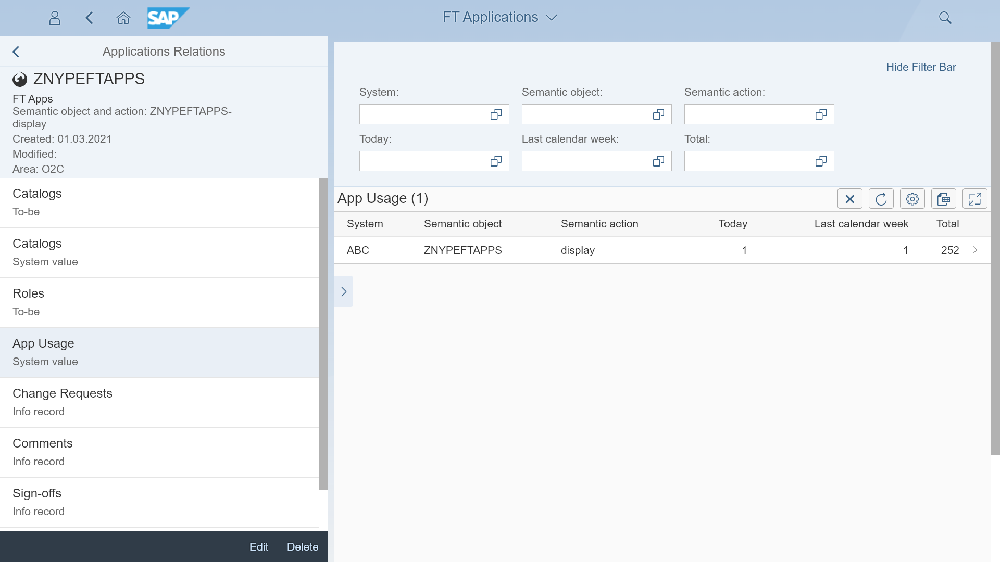

# Priority setting for development and support

Usage information is a valuable input for setting priorities for your development and support teams. With user statistic you can take informed decisions on:
- In support: which issues to handle first
- In development: which change requests develop first

