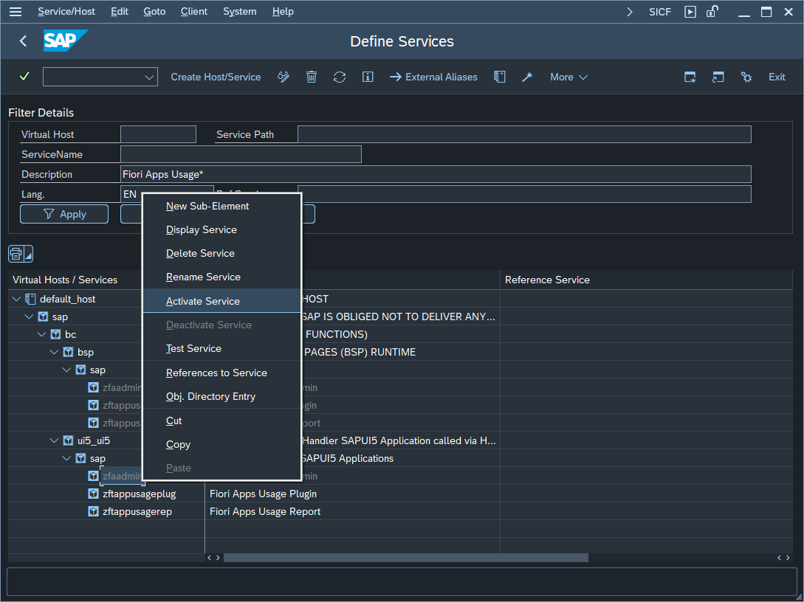

# Step 2 - Activate the Frontend ICF nodes

### 1. Open the list of all frontend services 

From SAP Gui run the transaction **SICF** and choose **Execute**

### 2. Activate the services
 
In the tree of services for path Path: `/default_host/sap/bc/ui5_ui5/sap/`, use right click and choose **Activate** for each of teh following services:

`zftappusagerep`

`zfaadmin`

`zftappusageplug` 

 

