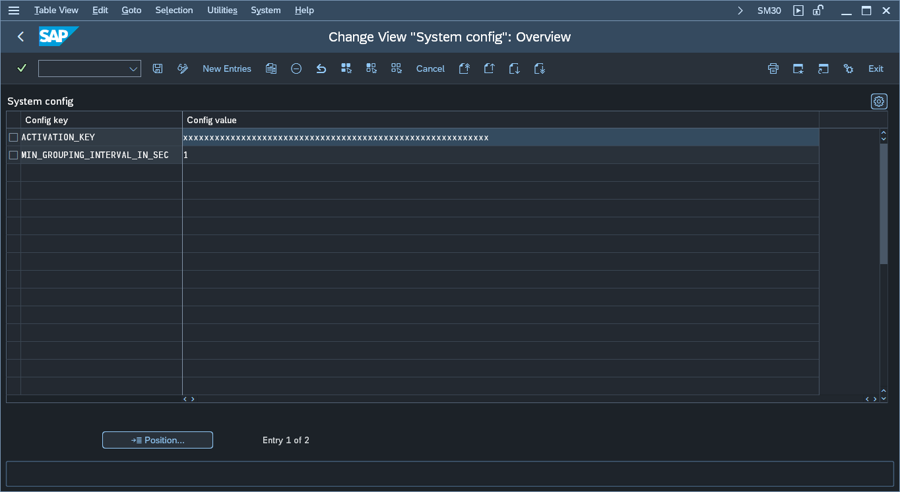

# Step 5 - Set the parameters for activation key and log mode

1. Go to SAP Gui transaction **ZFACENADMIN** and press the button labeled: *2. Edit configuration*. Pressing the button will open a maintenance view for table ZNYPEFACEN_SC:

2. In the configuration table add the following entries:

|Config key|Config value|
|--|--|
|ACTIVATION_KEY|*key provided by Nype's representative*|
| LOGMODE                      | **FULL** |

See also: [How to get the SAP system installation number](installation-number.md)

3. Go to SAP Gui tansaction **ZFAMANADMIN** and press the button *1. Edit configuration*.
