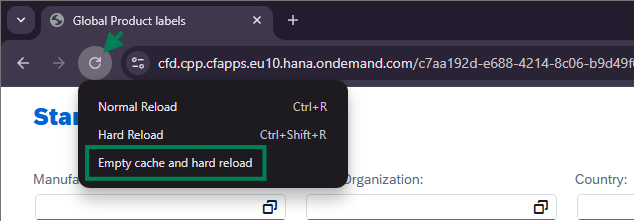

---
authors:
  - greg
tags:
  - SAP Fiori
  - SAP Fiori Launchpad
  - SAP S/4HANA
categories:
  - Testing solutions
date: 2018-01-10
description: A quick guide to clearing your Chrome or Edge browser cache to resolve common SAP Fiori display issues
---

# Quick tip: How to clear Chrome/Edge browser cache

To fix issues with SAP Fiori app in Chrome/Edge, clear the cache by following these steps:

<!-- more -->

1. Press function key ++f12++ on a keyboard
2. Right-click with the mouse on the Chrome toolbar button “Reload this page”
3. From the list of tree functions, choose the last one: “Empty Cache and Hard Reload”

Your Chrome / Edge browser cache is cleared.

