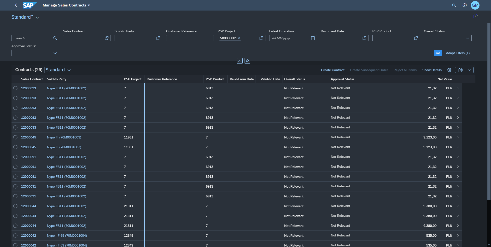

# "Manage Sales Contracts" (F1851) extension: Additional custom columns on list

## Extended SAP standard app

"Manage Sales Contracts" ([F1851]( https://fioriappslibrary.hana.ondemand.com/sap/fix/externalViewer/#/detail/Apps(%27F1851%27)/S23OP ))

## Requirement

Two additional columns for custom fields: 
1. PSP Project 
2. PSP Product 

<!-- more -->

## Screenshots

