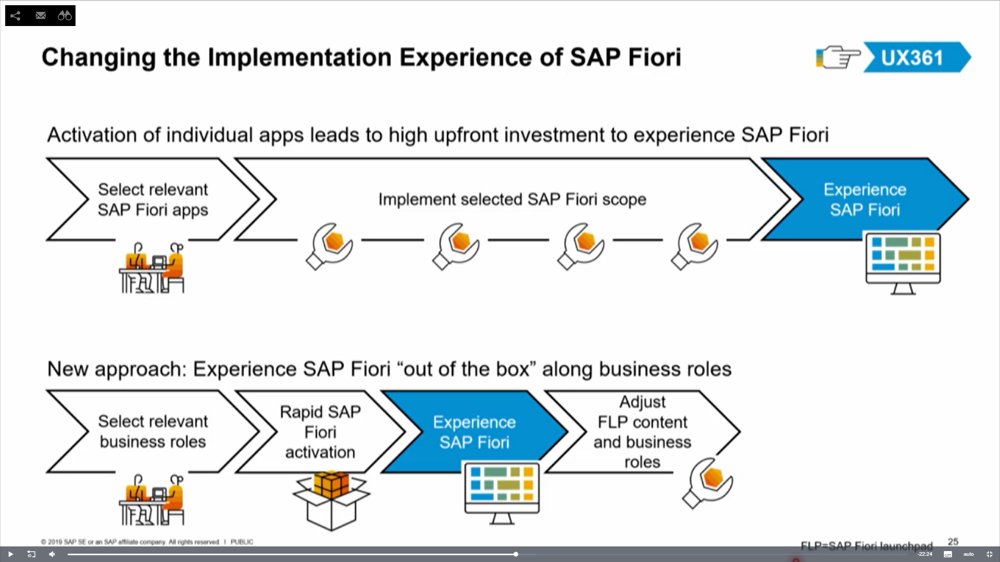

---
authors:
  - greg
categories:
  - Quick tips
tags:
  - SAP UI5
  - SAP Fiori
  - SAP Fiori Launchpad
  - SAP S/4HANA
date: 2022-08-22
---

# Instead of activating individual SAP Fiori applications, use the standard SAP roles as a template

Many SAP S/4HANA projects struggle with activating a subset of SAP Fiori applications chosen during fit gap analysis. Enabling the applications in this approach takes weeks and requires countless work days by the Basis and Fiori team to fix errors, which results in high implementation costs.
<!-- more -->
Examples of errors are:
App: Manage Sales Orders (F1873)
Error: "Navigation to this application is not supported" when navigating from line item.

Nevertheless, projects still use this method, although there is a faster, fundamentally different approach that I will point out in this short article.

Since 24 September 2019, instead of implementing individual apps, SAP recommends starting with apps that come from selecting business roles from the standard set. After choosing business roles you should use [Rapid Activation of SAP Fiori](https://help.sap.com/docs/SAP_S4HANA_ON-PREMISE/22bbe89ef68b4d0e98d05f0d56a7f6c8/999528cc1c8844a899ec94b48b2940d4.html?locale=en-US) (see also ["Activating SAP Fiori Content using Rapid Activation"](https://learning.sap.com/learning-journeys/learn-the-basics-of-sap-fiori/activating-sap-fiori-content-using-rapid-activation_e5061480-a49d-4007-ba78-9f60b89369e9) Learning Journey Lesson)  to activate the set of apps belonging to those selected business roles. The Standard set of roles serves as a template and a starting point for the SAP S/4HANA implementation project.

The procedure to follow is
1. Select relevant business roles
2. Use Rapid SAP Fiori activation in the Sandbox system
3. Experience SAP in the Sandbox system
4. During the implementation, adjust FLP content and business roles

Sven Krueppel-BerndtVP, SAP Fiori Portfolio & Consumption SAP SE covered the details of this approach in the presentation held on Teched Las Vegas 2019 on 24 September 2019. You will find the relevant section starting from the time mark: 24 minutes 20 seconds:

[https://events.sap.com/teched/en/session/48833](https://events.sap.com/teched/en/session/48833)

The quickest way to confirm that your errors result from "cherry-picking" the apps is temporarily assigning the standard SAP business role. You can find the relevant Business role in the app's documentation in the Fiori library in the section "Business Role(s)" of the "Implementation information" tab.