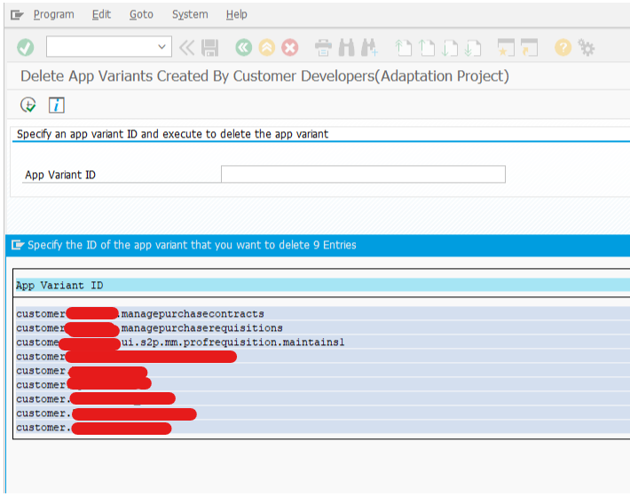
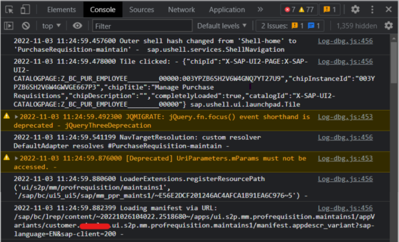

---
authors:
  - greg
tags:
  - SAP Fiori
  - SAP Fiori Launchpad
categories:
  - Quick tips
date: 2022-10-31
---

# How to check if the adaptation project is loading correctly?

The first step to check if the adaptation project is loading correctly is to verify if the adaptation is available on the front-end server. 

<!-- more -->

To check the availability use, the SAP Gui report started in transaction se38: /UI5/DEL_ADAPTATION_PROJECT. The search help available with F4 will show you all deployed adaptation projects. The report is available starting from SAP_UI 7.55.

To check if the adaptation project is loading correctly, follow the steps:

Open Fiori Launchpad

Run the SAPUI5 Diagnostic by using the following shortcut: CTRL+SHIFT+ALT+S (wait until it is fully loaded)

Open the console tab from Chrome “Developer tools.”

Lunch the extended app by clicking on the respective tile

In Console, look for messages with the following:
– a component ID defined for your adaptation project
– a “Tile clicked” with the respective catalog name

If the component ID and the catalog are correct, the adaptation project is loading correctly.

See also: Quick tip: How to check if the changes from the adaptation project are active?
