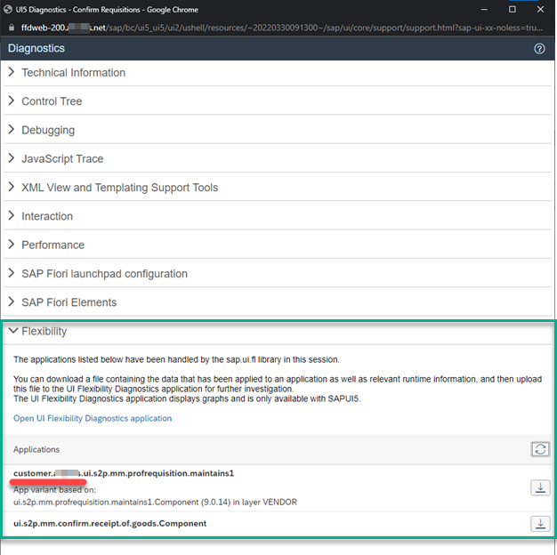

---
authors:
  - greg
tags:
  - SAP Fiori
  - SAP Fiori Launchpad
  - SAP S/4HANA
categories:
  - Quick tips
date: 2022-10-31
---

# How to check if the changes from the adaptation project are active?

Here is a step-by-step procedure on how to check if the adaptation project is active.

<!-- more -->

Open the app that you want to check

Run the SAPUI5 Diagnostic by using the following shortcut: CTRL+SHIFT+ALT+S

Expand the "Flexibility section"

If the adaptation project is active, you should see the custom namespace you set in your adaptation. For example: "customer.com.acme".

:fontawesome-brands-youtube:{ .youtube } [How to check if the changes from the adaptation project are active](https://youtu.be/WIK5yaSn5lI) - :octicons-clock-24: 25s

See also: [Quick tip: How to check if the adaptation project is loading correctly?](0003-adaptation-loading.md)
