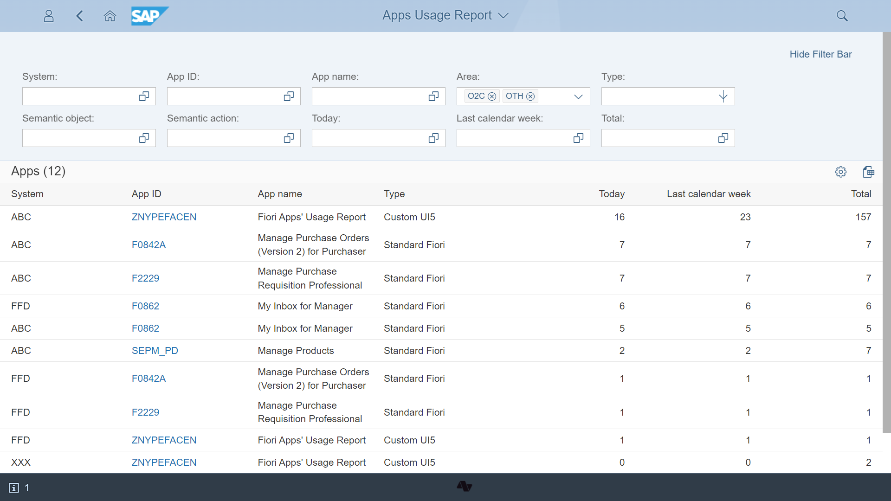
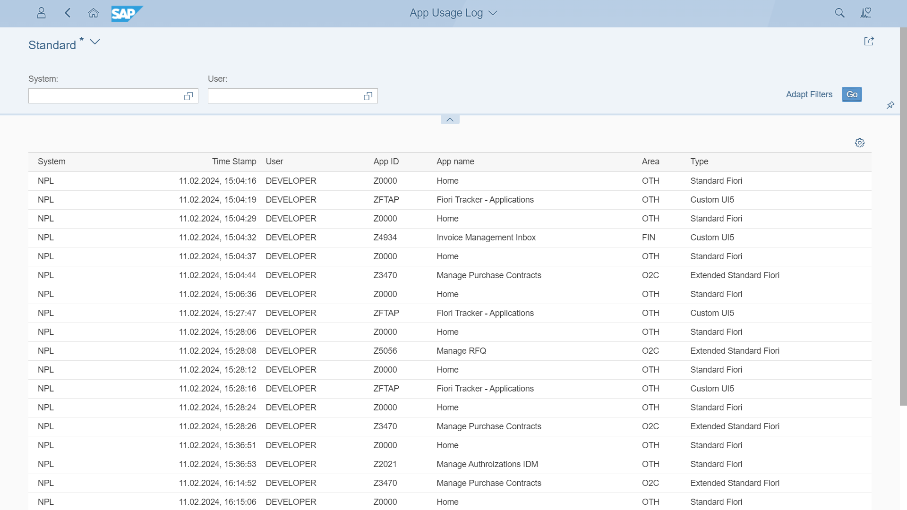

---
authors:
  - greg
tags:
  - SAP Fiori
  - SAP Fiori Launchpad
categories:
  - Project organization
date: 2019-12-20
description: In SAP Fiori's changing landscape, tracking app usage is crucial for organization and optimization, but standard SAP lacks built-in reporting tools for this.
---

# Tracking SAP Fiori Application Usage

In the the evolving landscape of SAP Fiori, tracking application usage is essential for project organization and optimizing, yet standard SAP does not  offer built-in reporting tools for this purpose.

<!-- more -->

## Understanding the Challenge

Tracking SAP Fiori application usage is vital for optimizing user experience, yet SAP does not provide a built-in way to report this data. Users cannot see which Fiori apps are most frequently used. 

This missing feature has been a significant issue for many users. To tackle it, Nype designed Fiori App Usage Report specifically for this purpose. Fiori App Usage Report is designed to enable organizations to collect usage statistics of their SAP Fiori applications.

## Introducing Fiori Tracker with Fiori App Usage Report

[Fiori App Usage Report report](https://fioriappsusage.org) is part of [Fiori Tracker Suite](https://fioritracker.org)  a custom solution developed by the Nype team to fill the gap left by SAP’s standard.

## How Fiori Tracker Works

Fiori Tracker collects app launch records across the SAP S/4HANA landscape. The app gathers the metrics including:

- App ID
- Time stamp
- Username

These insights can be accessed with report showing all logged records or most frequently used apps in overall, last week, or day.
All data is available for access or export to visualize or analyze with your favorite analytics tool. 

## SAP Notes on Usage Reporting

For insights into tracking SAP Fiori application usage, refer to the following SAP notes:

2586237 – Metrics about SAP Fiori Launchpad (is now archived. SAP consolidated all KBAs regarding Fiori Metrics into KBA 3203036.) 
2444406 – Google Analytics Integration with SAP Fiori 
2506498 – Monitoring SAP Fiori Application Usage 
2469965 – Tracking usage of mobile applications with SAP Fiori 

## Final note

Since its creation in 2019 Fiori Tracker has been improved numerous times. The latest version from May 2024 among other improvements includes [Fiori Role Testing](https://fioriroletesting.com/).

## 