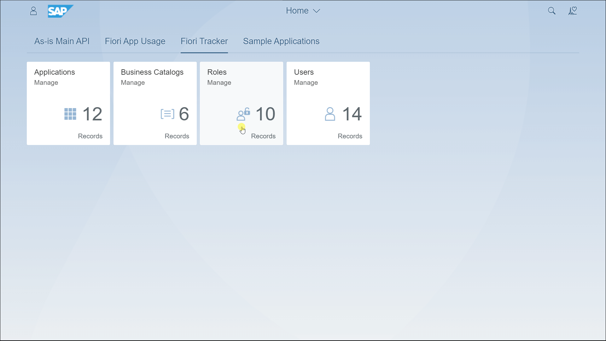

---
authors:
  - greg
tags:
  - SAP Fiori
  - SAP Fiori Launchpad
  - SAP S/4HANA
categories:
  - Testing solutions
date: 2024-04-27
description: The Test User app from Fiori Tracker Suite centralizes test user management for SAP Fiori developers.
---

# Streamlining SAP Fiori Testing with the Test User App from the Fiori Tracker Suite

The SAP S/4HANA project team supports SAP Fiori applications available through the SAP Fiori Launchpad. A critical aspect of this support is testing. Because SAP Fiori applications are [designed for specific roles](https://experience.sap.com/fiori-design-web/design-principles/#rolebased), reliable testing should take roles into account. The best way to consider roles in testing is using dedicated test users with only relevant roles assigned.

<!-- more -->

## Why Fast Test User Access matters?

Quick access to test users is crucial in several scenarios:

- During an implementation project, test users are needed to test configured processes and perform unit tests on custom apps or extensions. 

- In the support phase, they're essential for replicating reported issues and verifying if they have been resolved. With test users' details at hand, the SAP Fiori developer can immediately start his work. If not, he waits or gets involved in lengthy email exchanges to get access instead of developing the app, and the work on the request is delayed.

Details on the user name and pass are just a prerequisite. More problems can block the development:

- Locked users
- Validity expired
- Password changed by another team member
- The test user does not have the relevant roles
- Data is not available for that user

## Centralized Management

To avoid delays, the developer should have access to a centrally managed list of all test users. Functional consultants and authorization experts could decide what roles the test users should have, just as they planned the roles for the end users. 

## Solution: Test User App 

The [Test User app](https://fioritracker.org/sap-fiori-test-users/overview/) from [Fiori Tracker Suite](https://fioritracker.org) provides this function. This app logs all test users. It directly links test user records with roles and indirectly links them with catalogs and apps. Another Fiori Tracker Suite feature, "Blueprinting the roles for the end users," makes the linking so the role-catalog-app structure is always up to date. The app centralizes management and is accessible to everyone in the QA system, making your testing process swift. 

Best of all, Fiori Tracker is free if you let us feature your company name as a user. [Contact us](https://fioritracker.org/free-offer/) to get the installation file.
