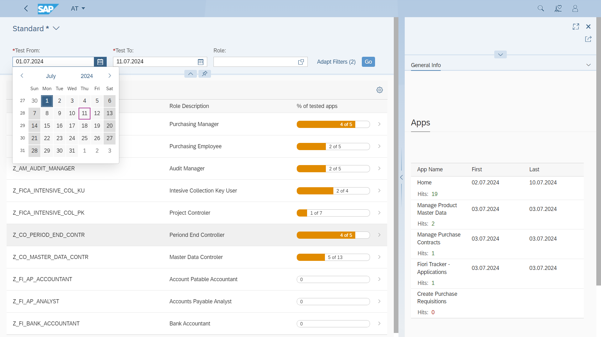

---
authors:
  - greg
tags:
  - SAP Fiori
  - SAP Fiori Launchpad
categories:
  - Project organization
date: 2024-05-10
description: Minimize repeated issues in role transitions to production system.
---

# Spot untested apps automatically with Fiori Role Testing

Ensuring the SAP project team thoroughly tests applications before production is crucial to avoid errors, downtime, and user dissatisfaction. Fiori Role Testing is an effective tool designed to quickly spot untested apps, ensuring comprehensive testing of all applications before deployment.

<!-- more -->

## What is Fiori Role Testing?

Fiori Role Testing is a robust tool developed to track if SAP Fiori application testing. It ensures that all SAP Fiori applications associated with specific roles are tested before they are rolled out to production environments. The tool uses field tested [Fiori App Usage](https://fioriappsusage.org)

## Getting Started with Fiori Role Testing

To start using Fiori Role Testing, visit the [Fiori Roles Testing page](http://fioriroletesting.com) for more detailed information and step-by-step instructions.

## See also 

For further reading, check out our related article: [How to speed up Jira issue creation for SAP Fiori applications](0006-jira-integration.md). This guide describes streamlining issue creation in Jira, further optimizing your testing.