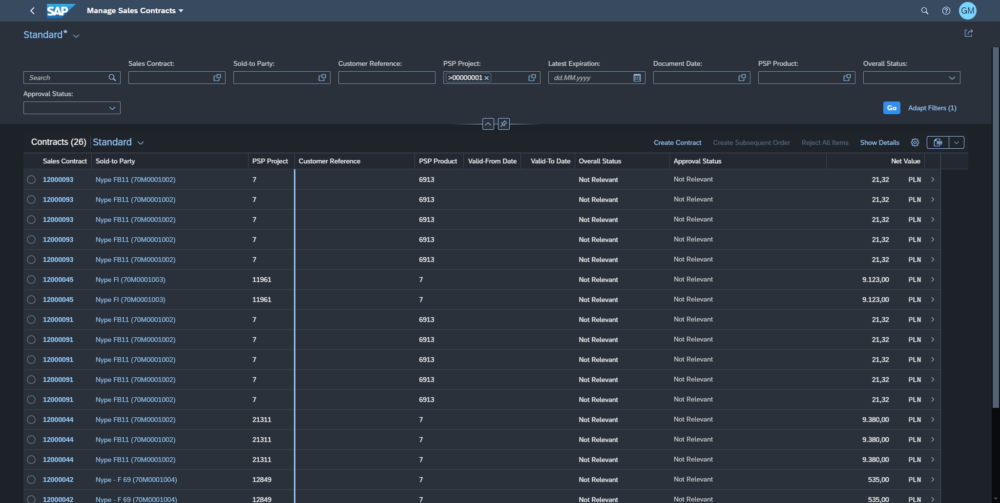

<!-- more -->

App: "Manage RFQ" extension [F2049]( https://fioriappslibrary.hana.ondemand.com/sap/fix/externalViewer/#/detail/Apps(%27F2049%27)/S23OP )

## Business scenarios

1. One-time suppliers handing (CpD /Conto pro Diverse/)
2. Enabling the change for 3 standard fields in adjusted process
3. "Date limiting quote reminder sending" field and handing

### 1. One-time suppliers handing (CpD /Conto pro Diverse/)

Custom fields, visibility and handling:

1. Search help to include one-time suppliers
2. One-time suppliers section with 7 custom fields (name, address, etc)
3. "General information" section: Hiding fields from standard RFQ
4. Quotation tab to include one-time suppliers name and bidder data

## Screenshots

