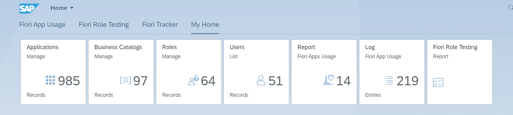

**Our 2018 SAP S/4HANA project was slowed down by repetitive SAP Fiori content management tasks.**

To streamline the collaboration in SAP team, we developed [**Fiori Tracker**](https://fioritracker.org/), a tool that has become integral to our work ever since.

**Fiori Tracker benefits**

-   :material-arrow-collapse-all:{ .lg .middle } Single source of truth
-   :material-crowd:{ .lg .middle } Project collaboration platform
-   :material-home-circle-outline:{ .lg .middle } Hosted in your SAP landscape
-   :material-clock-fast:{ .lg .middle } Set up in 1 day

**Fiori Tracker is built to support blueprinting.** 

It imports the system's catalogs and app lists, offering a user-friendly view for all SAP project members. The view links apps to roles, SAP Fiori app usage logs and other records. It serves as a central reference for all SAP S/4HANA developments.

**We offer Fiori Tracker at no cost for customers who agree to have their name published on the Fiori Tracker customer list.**

Our internal work with Fiori Tracker sharpens the tools we later use for client projects.