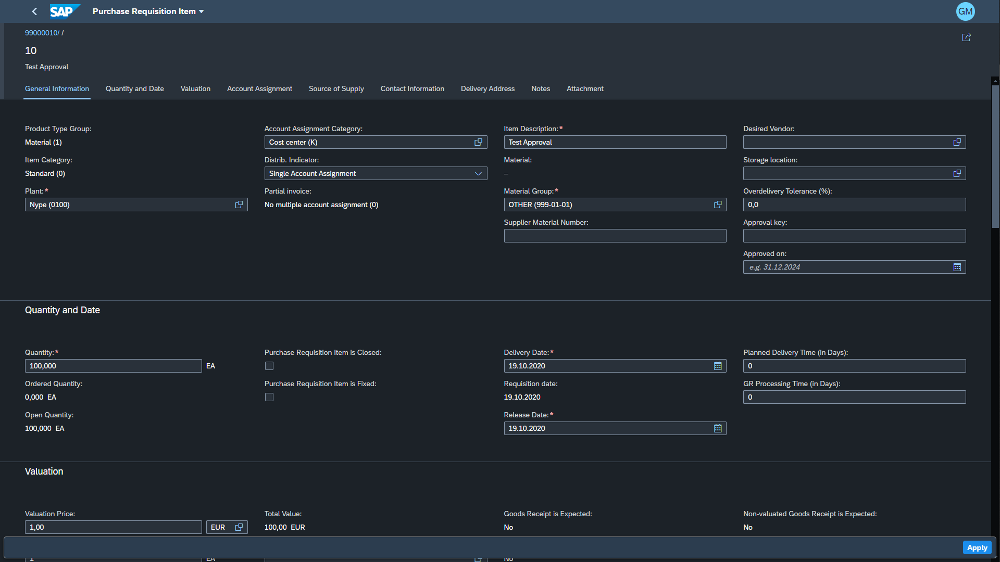

<!-- more -->

App: "Manage Purchase Requisition Professional" [F2229]( https://fioriappslibrary.hana.ondemand.com/sap/fix/externalViewer/#/detail/Apps(%27F2229%27)/S23OP )

## Business scenarios
1. Additional approval key handing for items from additional-approval-relevant material group
3. Over delivery-tolerance handling
4. Approved budget handling
5. One-time suppliers handing (CpD /Conto pro Diverse/)
6. Additional field "Customer Approval"
7. Custom field in "Approval log" section
8. Other
    - Hiding button "Create limit item"
    - Optimization of input field placement"
    - Disabling "Document type" selector
    - Additional button "Create RFQ" with visibility based on config table
    - Additional button "Restart Workflow" with visibility based on config table
    - Performance improvement

## Custom fields with handling

### 1. Additional approval key handing for items from 

Custom fields with handling on item level

1. "Approval key" - value required for items belonging to additional-approval-relevant material groups
2. "Approved on" - Date of approval

### 2. Over delivery-tolerance handling
Custom fields with handling on item level

1. "Over delivery Tolerance %" - Value taken over from purchase requisition

Custom fields with handling on item level

1. "Approved budget"
2. "Approver"

