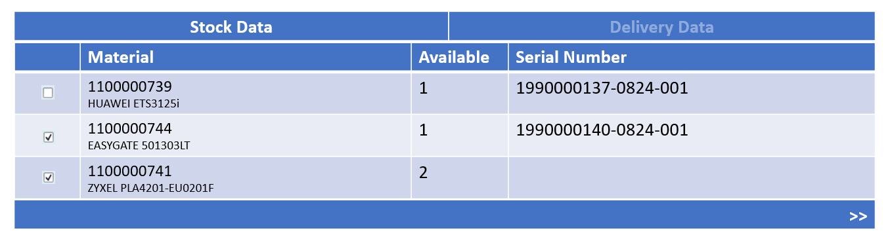
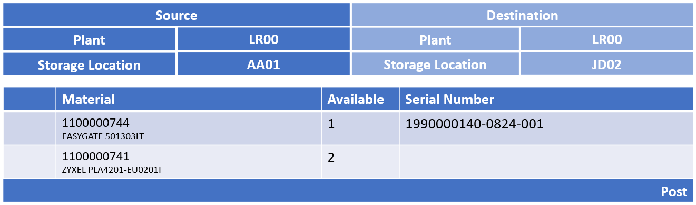
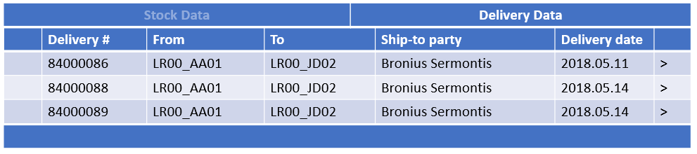
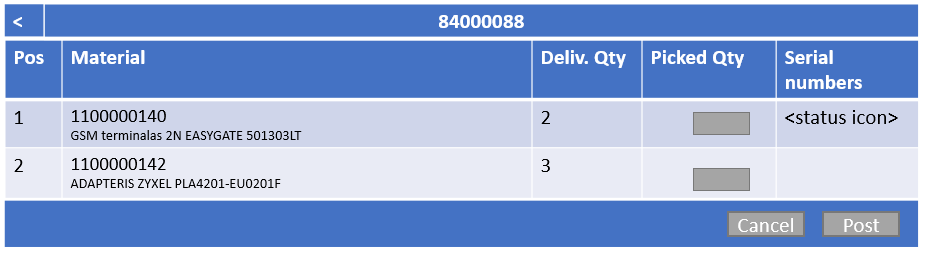
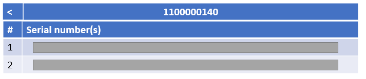

<!-- more -->

Custom application.

## Business scenario

Updating field representatives' dedicated stock. The stock represented items transported in the car. 

App accessible on the road from tablets.

Serial numbers handling. Two modes of picking:
    - Stock backed 
    - Delivery based

1. Stock based

2. Delivery based

